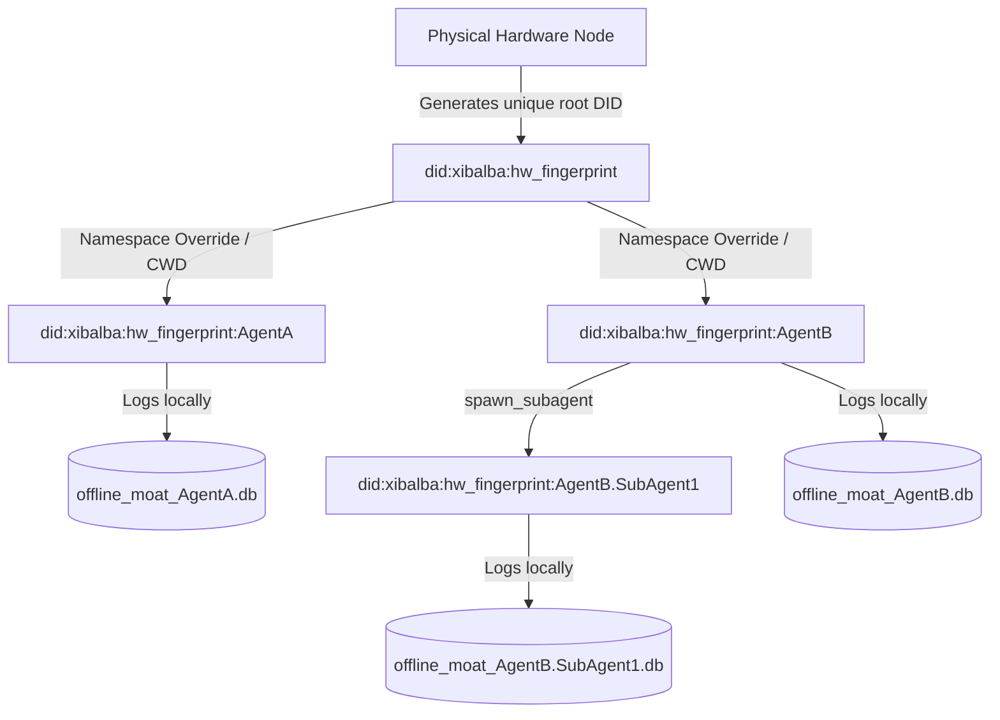

# System Architecture & Cryptographic Provenance 🛡️

The Integrity SDK acts as a **Zero-Trust Client Cryptographic Gateway** running on the host node of an autonomous agent. Its primary purpose is to establish identity non-repudiation and compile sensitive inference metadata into secure, verifiable spatial envelopes without introducing noticeable pipeline latency.

---

## 1. Hardware Fingerprinting & Provenance Engine

To prevent rogues or malicious processes from spoofing telemetry or copying an agent's on-chain stake registration, the SDK extracts immutable hardware bounds to establish physical provenance:

1. **System Attributes Extracted**:
   - **Machine ID**: Extracted from `/etc/machine-id` or `/var/lib/dbus/machine-id` to identify OS installations.
   - **MAC Address**: Retreived from active network adapters to bind local network presence.
   - **Hostname**: Captured to contextualize the server name.
   - **CPU Model**: Extracted via `/proc/cpuinfo` to establish execution capabilities.

2. **The Fingerprint Hash**:
   The attributes are canonicalized, concatenated, and hashed using deterministically salted **SHA-256**, generating a unique 64-character fingerprint:
   $$\text{Fingerprint} = \text{SHA256}(\text{MachineID} \parallel \text{MAC} \parallel \text{CPU} \parallel \text{Hostname})$$

3. **Deterministic Key Generation**:
   The fingerprint serves as a deterministic seed to generate a cryptographically secure **Ed25519** keypair.

---

## 2. W3C DID Document Structure

The generated public key is encapsulated into a standard W3C-compliant Decentralized Identifier (DID) Document.

- **DID URI Scheme**: `did:integrity:<fingerprint>`
- **Example Document**:
  ```json
  {
    "@context": "https://www.w3.org/ns/did/v1",
    "id": "did:integrity:52f9ea2197fd0e039...",
    "verificationMethod": [
      {
        "id": "did:integrity:52f9ea2197fd0e039...#key-1",
        "type": "Ed25519VerificationKey2020",
        "controller": "did:integrity:52f9ea2197fd0e039...",
        "publicKeyMultibase": "z6MkmF17..."
      }
    ],
    "authentication": [
      "did:integrity:52f9ea2197fd0e039...#key-1"
    ]
  }
  ```

---

## 3. High-Fidelity OTLP/gRPC Transport (v2.0)

To meet the demands of high-throughput AI systems, the SDK v2.0 utilizes the **OpenTelemetry Protocol (OTLP)** via **gRPC** as its primary transport layer.

1. **Multiplexing & Efficiency**: Using gRPC over HTTP/2 allows the SDK to maintain a single persistent connection to multiplex traces, metrics, and logs. This significantly reduces connection overhead compared to traditional REST/JSON calls.
2. **Binary Serialization**: Telemetry data is serialized into **Protocol Buffers (Protobuf)** before transmission, maximizing ingestion bandwidth over constrained or high-latency channels.
3. **Auto-Fallback**: For environments where gRPC is blocked by firewalls or gateways, the SDK automatically falls back to **OTLP/HTTP** endpoints.

---

## 4. Macroscopic Host Telemetry

The SDK observes how the agent manipulates its host environment to calculate security and operational risks:

- **Storage Flux (RW Ratio)**: Monitors the ratio of bytes written to bytes read. High write activity relative to read activity can indicate secure state updates, while unusual read spikes might indicate data exfiltration.
- **Access Path Entropy**: Measures the diversity of file system paths accessed by the agent. High entropy suggests an agent is "crawling" the system maliciously rather than accessing expected workspace directories.
- **Network Flow (IP Entropy)**: Tracks the entropy of destination IP addresses. A sudden spike in destination entropy can signal unauthorized lateral movement or reconnaissance behavior.

---

## 5. Microscopic Inference & MCP Tracing

The SDK implements deep observability into the agent's decision boundary:

- **GenAI Semantic Conventions**: Adheres to OTel v1.41 GenAI standards, capturing `gen_ai.system`, `gen_ai.agent.name`, token usage, and latency.
- **MCP Tool Tracing**: Generates enriched spans for **Model Context Protocol (MCP)** tool calls, explicitly recording the external context passed to the model and the specific tools executed.
- **Enriched Spans**: Prompt and completion content are captured within trace spans (where permitted), providing full visibility into the agent's internal state transitions.

---

## 6. SQLite Offline Cache Fallback (Preserved)

To prevent data loss or score drawdowns when the network is unstable or the Oracle is offline:
1. If the background HTTP request to `/ingest` throws a connection exception, the SDK catches the error.
2. The signed, cryptographically intact spatial envelope is immediately serialized and persisted into a local SQLite database located at `~/.integrity/offline_moat.db`.
3. A background sync thread polls the Oracle every 10 seconds.
4. Upon network restoration, the background thread automatically drains and uploads the cached backlog, ensuring **100% historical provenance and AIS metrics consistency**.

---

## 5. Zero-Knowledge Integration

The SDK implements the Aztec Noir prover framework:
- Private inputs (such as prompt texts or fine-grained token logprobabilities) never leave the local machine.
- The SDK compiles the private inputs using Noir local WASM or FFI bindings, computing mathematical safety metrics.
- Only the cryptographic **ZK Proof** is packaged and sent in the telemetry payload, allowing third-party auditors to verify that safety scores were honestly computed without ever reading raw text!

---

## 6. Multi-Agent & Sub-Agent Context Isolation

To support multiple, concurrent agents executing on the same host or cluster node, the SDK implements namespaced context isolation:



### 1. Independent Co-Located Agents
When independent agents share hardware:
* **Key Isolation**: Keys are stored at `{project_root}/.integrity/did/{agent_id}/`. This isolates public/private keys using the logical context identifier, preventing permission collisions.
* **Database Isolation**: The local SQLite database path is resolved using the agent's name (`~/.integrity/offline_moat_{agent_id}.db`). This avoids transaction locking (`database is locked` error) when multiple processes log events simultaneously.

### 2. Hierarchical Sub-Agent Mapping
When a parent agent spawns a helper/sub-agent:
* **Hierarchical DIDs**: The SDK constructs a nested identifier (`parent_id.child_id`).
* **Inheritance Rules**: The parent DID key is used as the cryptographic anchor, establishing a chain of trust that the Oracle can verify to trace downstream execution limits.
