# Integrity Protocol Lifecycle Mind Map
## From Data Ingestion to Reputation Metrics

This document visualizes and maps the end-to-end cryptographic and compliance validation stages of the **Xibalba Integrity Protocol**.

```mermaid
graph TD
    %% Main Node
    root((Integrity Protocol Lifecycle))
    style root fill:#2A2D34,stroke:#3F88C5,stroke-width:4px,color:#fff
    
    %% Stage 1: Infrastructure
    root --> S1[1. Infrastructure Foundation]
    style S1 fill:#E4F0EC,stroke:#1C7C54,stroke-width:2px
    S1 --> S1_trig("Validation Trigger:<br>On-chain contract instantiation")
    S1 --> S1_art("Evidence Artifact:<br>Base L2 Tx Hash & Contract Address")
    S1 --> S1_hipaa("Regulatory Mapping:<br>HIPAA 45 CFR § 164.312(c)(1) (Integrity)")
    
    %% Stage 2: Identity
    root --> S2[2. Identity & Security Layer]
    style S2 fill:#FBF2E9,stroke:#D67E2A,stroke-width:2px
    S2 --> S2_trig("Validation Trigger:<br>Hardware fingerprinting & EIP-712 Claim")
    S2 --> S2_art("Evidence Artifact:<br>W3C DID Document & ReputationSBT Mint")
    S2 --> S2_hipaa("Regulatory Mapping:<br>HIPAA 45 CFR § 164.312(a)(1) (Access/Auth)")
    
    %% Stage 3: BCC
    root --> S3[3. Behavioral Trust & Intent]
    style S3 fill:#ECE1F3,stroke:#7D3C98,stroke-width:2px
    S3 --> S3_trig("Validation Trigger:<br>Pre-commit payload in commit_action_intent")
    S3 --> S3_art("Evidence Artifact:<br>BCCCommitment object & OPA evaluation JSON")
    S3 --> S3_hipaa("Regulatory Mapping:<br>HIPAA 45 CFR § 164.312(b) (Audit Controls)")
    
    %% Stage 4: ZK-ML
    root --> S4[4. Mathematical Verification]
    style S4 fill:#E8F4F8,stroke:#2E86C1,stroke-width:2px
    S4 --> S4_trig("Validation Trigger:<br>Local proving at the edge via Aztec Noir")
    S4 --> S4_art("Evidence Artifact:<br>Aztec Noir UltraPlonk ZK Proof")
    S4 --> S4_hipaa("Regulatory Mapping:<br>HIPAA 45 CFR § 164.312(e)(1) (Transmission)")
    
    %% Stage 5: Reputation
    root --> S5[5. Economic & Compliance]
    style S5 fill:#FCF3CF,stroke:#B7950B,stroke-width:2px
    S5 --> S5_trig("Validation Trigger:<br>Telemetry ingestion & Tri-Metric AIS scoring")
    S5 --> S5_art("Evidence Artifact:<br>StateAnchor.sol Merkle roots & CCIP logs")
    S5 --> S5_hipaa("Regulatory Mapping:<br>HIPAA 45 CFR § 164.312(b) (Audit & HSCC)")
```

---

## Validation Stage Details

### 1. Infrastructure Foundation
*   **Description:** Setting up the core execution environments on EVM-compatible L2s (Base L2).
*   **Validation Trigger:** On-chain contract deployment (e.g. `SovereignAgent.sol`, `AuditShield.sol`).
*   **Evidence Artifact:** Base L2 Transaction Hash & contract address.
*   **Regulatory Mapping:** **HIPAA 45 CFR § 164.312(c)(1) (Integrity)**: Ensures the system state is initialized on a tamper-proof public ledger.

### 2. Identity & Security Layer
*   **Description:** Establishing hardware-tethered identity for non-repudiation.
*   **Validation Trigger:** Extraction of physical fingerprint in TEE & EIP-712 "Ownership Claim" signed challenge.
*   **Evidence Artifact:** W3C DID document (`did:xibalba:<hardware_hash>`) & minting of the `ReputationSBT` (Soulbound Token).
*   **Regulatory Mapping:** **HIPAA 45 CFR § 164.312(a)(1) (Access Control / Entity Authentication)**: Maps virtual AI actions directly to physical silicon.

### 3. Behavioral Trust & Intent (BCC)
*   **Description:** Enforcing intent declaration prior to system state mutation.
*   **Validation Trigger:** Invoking `commit_action_intent` with serialized canonical JSON state.
*   **Evidence Artifact:** The signed `BCCCommitment` envelope containing the `intended_state_hash` and the OPA policy evaluation payload.
*   **Regulatory Mapping:** **HIPAA 45 CFR § 164.312(b) (Audit Controls)**: Allows comprehensive post-hoc audit logs of what the agent intended to execute.

### 4. Mathematical Verification (ZK-ML)
*   **Description:** Private attestation of AI metrics without raw data disclosure.
*   **Validation Trigger:** SDK compilation of Aztec Noir circuits using local secret inputs (WITNESS).
*   **Evidence Artifact:** Aztec Noir UltraPlonk Zero-Knowledge Proof (ZKP).
*   **Regulatory Mapping:** **HIPAA 45 CFR § 164.312(e)(1) (Transmission Security)**: Validates compliance metrics while ensuring raw EMR data/PHI never leaves the local TEE.

### 5. Economic & Compliance Observability (Scoring)
*   **Description:** Calculation of the Agent Integrity Score (AIS) and cross-chain bridging of reputation.
*   **Validation Trigger:** Ingestion of verified proofs and telemetry into the PostgreSQL Trust Vault, triggering real-time Tri-Metric calculation (Entropy, Grounding, Sacrifice).
*   **Evidence Artifact:** Merkle roots posted to `StateAnchor.sol`, off-chain DB logs, and `CCIPReputationBridge` logs.
*   **Regulatory Mapping:** **HIPAA 45 CFR § 164.312(b) (Audit Controls / HSCC Compliance)**: Yields a verifiable, continuous historical record required for HSCC AI Third-Party Risk audits.
